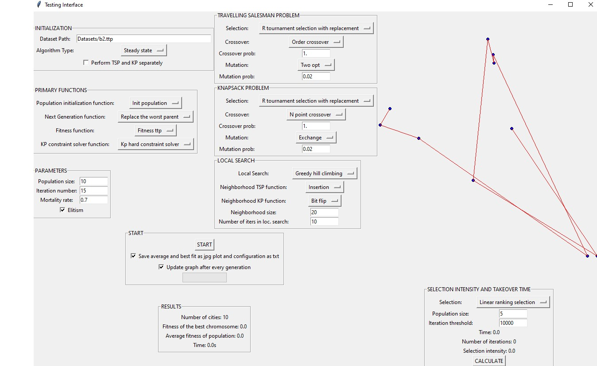

# Memetic Algorithm (Genetic Algortihm + Local Search)
Memetic algorithm for solving the TTP problem. To use the GUI, run the "main.py" file with Python 3.8 and install the libraries from the requirements.txt (pip install -r requirements.txt). To start the algorithm from the GUI press "Start".
To perform Testing of Selective Pressure on selection operators, choose the selection and press "Calculate". The Testing of Selective Pressure runs independantly from the main algorithm.
The datasets used can be found in the "Datasets" folder.
The Results are in the "Results" folder.

